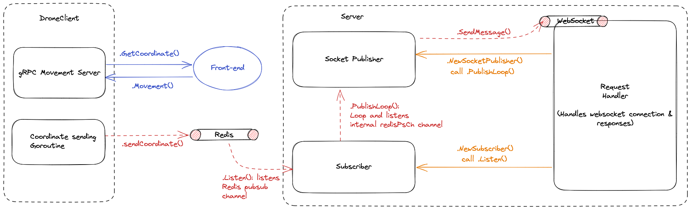

# droneshield-test

Microservices to simulate the communication between drone (client) and the command center (server).



## Getting started

Please install & run`docker` along with `docker-compose` in your machine (e.g., Rancher Desktop, Docker Desktop, Podman Desktop). Then executes:

```bash
# initialize redis container
make redis
```

## To start the drone (client)
```bash
make client
```

## To start the server
```bash
make serve
```

## Unit Tests
```bash
# clean test cache
make test-clean-cache

# execute unit tests
make test-unit
```

## Integration Test
```bash
# clean test cache
make test-clean-cache

## start the client & server
make client
make serve

# execute ingration test
make test-integration
```

## gRPC Contracts

If you need gRPC contracts to interact with drone, please redirect to [droneshield-test-upstream respository](https://github.com/jasonkwh/droneshield-test-upstream).

## Screenshots


